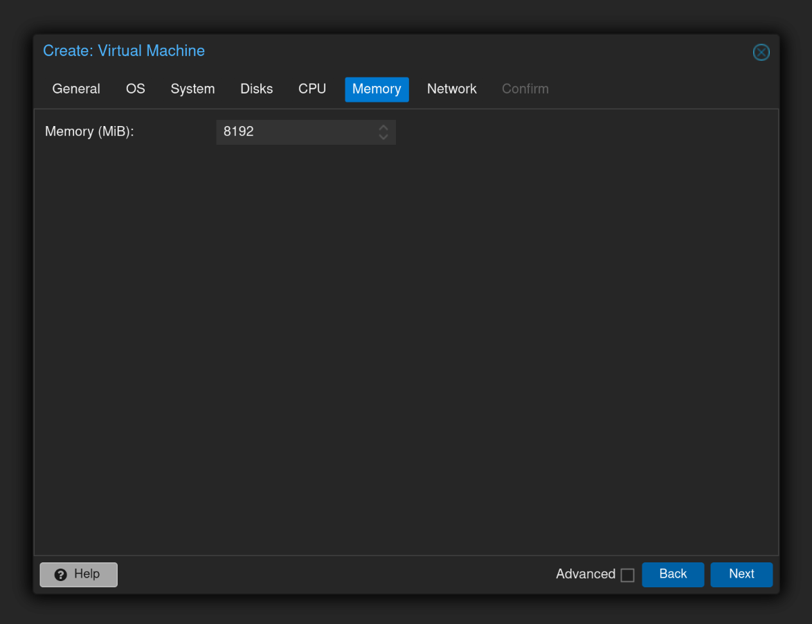

# Media Server

Ever felt like the big media conglomerates have been holding your favorite shows, movies, and music hostage behind endless paywalls? Introducing The Freeflix Project - the modern-day freedom fighter that’s flipping the bird to the suits, doing everything from gathering torrents to serving you content like an overzealous butler. Here's how it works:

## User Flow

1. **Jellyseerr**: You ask for something - movie, music, or show. Jellyseerr takes your request like the humble servant it is.
2. **Radarr**, **Lidarr**, or **Sonarr**: Jellyseerr sends the task to its trusty underlings: Radarr for movies, Lidarr for music, and Sonarr for shows. These work tirelessly to fulfill your media cravings.
3. **Prowlarr**: All three services query their loyal indexers through Prowlarr, who’s essentially the Sherlock Holmes of torrent hunting, sniffing out the best sources.
4. **qBittorrent**: After tracking down the best torrents, Prowlarr hands them off to qBittorrent for some good old-fashioned downloading (peer-to-peer style, because why pay when you don’t have to?).
5. **Privacy**: But hey, we’re not that bold. We route all network traffic for Prowlarr and qBittorrent through a VPN, because privacy matters, and Big Brother doesn’t need to know about your midnight movie marathons.
6. **File Organization**: Once the download is finished, we play media librarian and move those files to their rightful homes in your media folders. No more hunting for your stuff.
7. **Emby**: Emby does what it does best - scanning your newly organized folders and keeping your library fresh and ready to roll.
8. **Bazarr**: Of course, we can’t let you watch content without some proper subtitles. Bazarr grabs those, like a personal assistant, and makes sure they’re in the right place.
9. **Your Entertainment**: Finally, you’re free to stream the content via Emby - because who needs cable or those subscription services when you’ve got this setup?

## Services

Oh, and did we mention? This whole setup is containerized with **Podman**. That means you can forget about the usual installation nightmares or dependency conflicts. You just spin up the services in their own isolated containers, and boom, you're up and running. It's like having a super-organized virtual assistant for your server - everything in its place, no fuss. Managing and scaling services is now as easy as clicking a button.

| Name                                             | Description                        |
|--------------------------------------------------|------------------------------------|
| [Jellyseerr](https://docs.jellyseerr.dev)        | Media request system               |
| [Radarr](https://wiki.servarr.com/en/radarr)     | Movie collection manager           |
| [Lidarr](https://wiki.servarr.com/en/lidarr)     | Music collection manager           |
| [Sonarr](https://wiki.servarr.com/en/sonarr)     | Show collection manager            |
| [Bazarr](https://www.bazarr.media)               | Subtitle collection manager        |
| [Prowlarr](https://wiki.servarr.com/en/prowlarr) | Torrent and Usenet indexer manager |
| [qBittorrent](https://www.qbittorrent.org)       | P2P BitTorrent client              |
| [GlueTun](https://github.com/qdm12/gluetun-wiki) | VPN client using ProtonVPN         |
| [Emby](https://emby.media)                       | Media server                       |

## Create Virtual Machine





## Setup Virtual Machine

### 1. Update System Packages

Update the package repository information and upgrade all installed packages.

```shell
sudo dnf update -y && sudo dnf upgrade -y --refresh
```

### 2. Install Additional Packages

Install essential tools needed for container management, network file sharing, and editing files.

```shell
sudo dnf install -y podman podman-compose cifs-utils nano
```

Ensure user services run after logout or at boot.

```shell
sudo loginctl enable-linger <username>
```

Reboot the machine ensuring lingering changes take effect.

```shell
sudo reboot
```

### 3. Configure and Mount Storage

Create the mount directory and assign ownership to the **manager** user.

```shell
sudo mkdir /storage
sudo chown -R manager:manager /storage
```

Set up a credentials file to securely store SMB/CIFS login details.

```shell
sudo touch /etc/storage_credentials
sudo chmod 600 /etc/storage_credentials
sudo nano /etc/storage_credentials
```

Paste the following content into the credentials file, replacing `<password>` with the actual password.

```text
username=manager
password=<password>
domain=WORKGROUP
```

Configure `/etc/fstab` to automatically mount the network share at boot.

```shell
sudo nano /etc/fstab
```

Add the following line to `/etc/fstab` to define the network share mount, specifying the IP address of the storage server, the shared folder, and the credentials file:

```text
//192.168.60.10/storage /storage cifs credentials=/etc/storage_credentials,uid=1000,gid=1000,iocharset=utf8,vers=3.0 0 0
```

Reload systemd manager configuration and mount all filesystems.

```shell
sudo systemctl daemon-reload
sudo mount -a
```

## Port Redirection

When running **Podman rootless containers**, one common issue encountered is the inability to bind containers to ports below 1024. This is due to the restriction that rootless containers cannot bind to "privileged" ports (those lower than 1024), as these ports require root privileges. For example, binding to ports such as 80 (HTTP) or 443 (HTTPS) is not possible in rootless mode without special workarounds.

There are various solutions to this problem, including using **setcap**, configuring **iptables**, or leveraging a **proxy solution**.

However, one of the most straightforward, efficient, and **cross-platform** solutions to this problem is using **redir**. `redir` is a simple command-line tool that allows you to redirect network traffic from one port to another. By using `redir`, you can effectively allow your rootless container to listen on a privileged port by redirecting traffic from the low port to a higher port, where the rootless container is permitted to bind.

In this section, we will show you how to install and configure **redir** and how to set it up as a system service using **systemd**.

### 1. Install Package

Install `redir` using your package manager.

```shell
sudo dnf install -y redir
```

### 2. Create Systemd Services

Create the systemd service file for **HTTP**.

```shell
sudo nano /etc/systemd/system/redir-http.service
```

Add the following content and save.

```ini
[Unit]
Description=Redirect HTTP port for local containers
After=network.target

[Service]
ExecStart=/bin/redir -I http -l err -s -n :80 127.0.0.1:8880
Restart=always
User=root

[Install]
WantedBy=multi-user.target
```

Create the systemd service file for **HTTPS**.

```shell
sudo nano /etc/systemd/system/redir-https.service
```

Add the following content and save.

```ini
[Unit]
Description=Redirect HTTPS port for local containers
After=network.target

[Service]
ExecStart=/bin/redir -I https -l err -s -n :443 127.0.0.1:4443
Restart=always
User=root

[Install]
WantedBy=multi-user.target
```

### 3. Enable and Start Services

Reload the systemd configuration.

```shell
sudo systemctl daemon-reload
```

Enable and start both services.

```shell
sudo systemctl enable redir-http.service redir-https.service
sudo systemctl start redir-http.service redir-https.service
```

## Firewall Permissions

Enable the SELinux boolean to allow containers to access devices as needed.

```shell
sudo setsebool -P container_use_devices 1
```

Open the HTTP/80 and HTTPS/443 ports in the firewall, allowing access for devices within your home network.

> Remember that `redir` will forward port `80` to `8880` and port `443` to `4443`

```shell
sudo firewall-cmd --permanent --add-port=80/tcp
sudo firewall-cmd --permanent --add-port=443/tcp
sudo firewall-cmd --permanent --add-port=8881/tcp
sudo firewall-cmd --reload
sudo firewall-cmd --list-all
```

## Setup Containers

### 1. Create Freeflix Directory

Create the main `freeflix` directory in your home folder.

```shell
mkdir -p ~/freeflix
```

### 2. Create Storage Symlink

Create a symbolic link to `/storage`.

> The purpose of this symlink is to maintain a consistent directory structure, whether using local storage or a remote file share. If the remote share isn’t available, the symlink still provides a standardized path, simplifying container configuration and management.

```shell
ln -s /storage ~/freeflix/storage
```

### 3. Initial Directory Structure

Create directories for configuration files and organized media/download folders.

```shell
mkdir -p ~/freeflix/config
mkdir -p ~/freeflix/storage/media/{movies,music,shows}
mkdir -p ~/freeflix/storage/torrents/{movies,music,shows}
mkdir -p ~/freeflix/storage/usenet/{movies,music,shows}
```

### 4. Directory Tree Overview

This section provides an overview of the initial directory structure, designed to be consistent and easy to navigate. The structure is organized to facilitate clear separation of data and configuration files, while also considering access requirements for various containers.

Downloads are systematically categorized and supported by qBittorrent, ensuring organized storage. Additionally, each container service has dedicated **config** subdirectories to streamline setup and management.

```text
│
├─── storage
│   │
│   ├─── media
│   │   ├─── movies
│   │   ├─── music
│   │   └─── shows
│   │
│   ├─── torrents
│   │   ├─── movies
│   │   ├─── music
│   │   └─── shows
│   │
│   └─── usenet
│       ├─── movies
│       ├─── music
│       └─── shows
│
├─── config
│   │
│   ├─── proxy
│   ├─── qbittorrent
│   ├─── jellyseerr
│   ├─── radarr
│   ├─── lidarr
│   ├─── sonarr
│   ├─── bazarr
│   └─── prowlarr
│
├─── .env
└─── compose.yaml
```

### 4. Environment Variables

Create the `.env` file used by `compose.yaml` to define environment-specific configurations and secrets.

```shell
nano ~/freeflix/.env
```

An example template of the environment variables you might include. Be sure to replace placeholder values like `<private-key>` with your actual VPN private key and adjust other variables to match your system and preferences. For a complete list of VPN providers, visit the [Gluetun Wiki](https://github.com/qdm12/gluetun-wiki/tree/main/setup/providers).

```text
PUID=1000
PGID=1000
TZ=Australia/Melbourne

VPN_TYPE=wireguard
VPN_SERVICE_PROVIDER=protonvpn
WIREGUARD_PRIVATE_KEY=<private-key>
SERVER_COUNTRIES=Australia
SERVER_CITIES=Melbourne,Sydney

TORRENTING_PORT=6881
WEBUI_PORT=8971
PROWLARR_PORT=9696
FLARESOLVERR_PORT=8191
```

### 5. Compose File

Create the `compose.yaml` file, which defines the container services, networks, and volumes required for Freeflix. This file orchestrates how your containers are built and interconnected, ensuring a streamlined deployment process.

Containers are connected via an internal bridge network, allowing secure and efficient communication between services. The services themselves only expose necessary ports internally; they do not directly publish or open ports on the host machine. Instead, **HTTP** and **HTTPS** traffic is managed through a reverse proxy, forwarding requests to the appropriate services based on your configuration.

To create and edit the compose file, run:

```shell
nano ~/freeflix/compose.yaml
```

Paste the service definitions into this file and save.

```yaml
services:

  proxy:
    image: docker.io/jc21/nginx-proxy-manager:latest
    container_name: proxy
    environment:
      DB_SQLITE_FILE: /data/database.sqlite
    volumes:
      - ./config/proxy/data:/data:z
      - ./config/proxy/letsencrypt:/etc/letsencrypt:z
    ports:
      - 8880:80
      - 8881:81
      - 4443:443
    networks:
      media-network:
        ipv4_address: 172.40.0.10
    security_opt:
      - label=disable
    healthcheck:
      test: [ "CMD", "/usr/bin/check-health" ]
      interval: 10s
      timeout: 3s
    restart: unless-stopped

  gluetun:
    image: docker.io/qmcgaw/gluetun:latest
    container_name: gluetun
    cap_add:
      - NET_ADMIN
    devices:
      - /dev/net/tun:/dev/net/tun
    env_file: .env
    expose:
      - ${TORRENTING_PORT}
      - ${WEBUI_PORT}
      - ${PROWLARR_PORT}
      - ${FLARESOLVERR_PORT}
    networks:
      media-network:
        ipv4_address: 172.40.0.11
    security_opt:
      - label=disable
    healthcheck:
      test: ping -c 1 9.9.9.9 || exit 1
      timeout: 5s
      retries: 5
    restart: unless-stopped

  qbittorrent:
    image: docker.io/linuxserver/qbittorrent:latest
    container_name: qbittorrent
    env_file: .env
    userns_mode: keep-id
    volumes:
      - ./config/qbittorrent:/config
      - ./storage/torrents:/data/torrents
      - ./storage/media:/data/media
    network_mode: service:gluetun
    depends_on:
      gluetun:
        condition: service_healthy
        restart: true
    security_opt:
      - label=disable
    restart: unless-stopped

  prowlarr:
    image: docker.io/linuxserver/prowlarr:latest
    container_name: prowlarr
    env_file: .env
    volumes:
      - ./config/prowlarr:/config
    network_mode: service:gluetun
    security_opt:
      - label=disable
    depends_on:
      gluetun:
        condition: service_healthy
        restart: true
    restart: unless-stopped

  flaresolverr:
    image: docker.io/flaresolverr/flaresolverr:latest
    container_name: flaresolverr
    env_file: .env
    network_mode: service:gluetun
    security_opt:
      - label=disable
    depends_on:
      gluetun:
        condition: service_healthy
        restart: true
    restart: unless-stopped

  jellyseerr:
    image: docker.io/fallenbagel/jellyseerr:latest
    container_name: jellyseerr
    env_file: .env
    volumes:
      - ./config/jellyseerr:/app/config
    expose:
      - 5055
    networks:
      media-network:
        ipv4_address: 172.40.0.12
    security_opt:
      - label=disable
    restart: unless-stopped

  radarr:
    image: docker.io/linuxserver/radarr:latest
    container_name: radarr
    env_file: .env
    userns_mode: keep-id
    volumes:
      - ./config/radarr:/config
      - ./storage/torrents:/data/torrents
      - ./storage/media:/data/media
    expose:
      - 7878
    networks:
      media-network:
        ipv4_address: 172.40.0.13
    security_opt:
      - label=disable
    restart: unless-stopped

  lidarr:
    image: docker.io/linuxserver/lidarr:latest
    container_name: lidarr
    env_file: .env
    userns_mode: keep-id
    volumes:
      - ./config/lidarr:/config
      - ./storage/torrents:/data/torrents
      - ./storage/media:/data/media
    expose:
      - 8686
    networks:
      media-network:
        ipv4_address: 172.40.0.14
    security_opt:
      - label=disable
    restart: unless-stopped

  sonarr:
    image: docker.io/linuxserver/sonarr:latest
    container_name: sonarr
    env_file: .env
    userns_mode: keep-id
    volumes:
      - ./config/sonarr:/config
      - ./storage/torrents:/data/torrents
      - ./storage/media:/data/media
    expose:
      - 8989
    networks:
      media-network:
        ipv4_address: 172.40.0.15
    security_opt:
      - label=disable
    restart: unless-stopped

  bazarr:
    image: docker.io/linuxserver/bazarr:latest
    container_name: bazarr
    env_file: .env
    userns_mode: keep-id
    volumes:
      - ./config/bazarr:/config
      - ./storage/torrents:/data/torrents
      - ./storage/media:/data/media
    expose:
      - 6767
    networks:
      media-network:
        ipv4_address: 172.40.0.16
    security_opt:
      - label=disable
    restart: unless-stopped

  emby:
    image: docker.io/linuxserver/emby:latest
    container_name: emby
    env_file: .env
    volumes:
      - ./config/emby:/config
      - ./storage/media:/data/media
    expose:
      - 8096
    networks:
      media-network:
        ipv4_address: 172.40.0.17
    security_opt:
      - label=disable
    restart: unless-stopped

networks:
  media-network:
    name: media-network
    driver: bridge
    ipam:
      config:
        - subnet: 172.40.0.0/24

x-podman:
  in_pod: false
```

After saving, navigate to the application directory and start the containers.

```shell
cd ~/freeflix
podman-compose up -d
```

## Proxied Services

### 1. Update Credentials

Access the proxy dashboard by navigating to http://192.168.60.11:8881 and log in using the default credentials:

* **Username**: admin@example.com
* **Password**: changeme

Once logged in you'll be prompted to set a new secure password.

### 2. AWS Managed Domains

To configure your custom domain with AWS Route 53:

* Log into the AWS Management Console and navigate to Route 53.
* Select the **Hosted Zone** associated with your domain name.
  * Add an **A** record for the root level domain:
    * **Name**: `media.your-domain.com`
    * **Value**: `192.168.60.11`
  * Add a **CNAME** record for subdomains:
    * **Name**: `*.media.your-domain.com`
    * **Value**: `media.your-domain.com`
  * Make note of the **Hosted Zone ID**, as you'll need it for permissions and scripting.

### 3. AWS Managed Policy

Create an IAM policy to allow your services to interact with Route 53:

* Log into the AWS IAM Console.
* Navigate to **Policies** and click the **Create Policy** button.
* Select the **JSON** tab and paste the following policy, replacing `<HOSTED-ZONE-ID>` with your actual Hosted Zone ID:
    ```json
    {
        "Version": "2012-10-17",
        "Statement": [
            {
                "Effect": "Allow",
                "Action": [
                    "route53:ListResourceRecordSets",
                    "route53:ChangeResourceRecordSets",
                    "route53:GetChange"
                ],
                "Resource": [
                    "arn:aws:route53:::hostedzone/<HOSTED-ZONE-ID>",
                    "arn:aws:route53:::change/*"
                ]
            },
            {
                "Effect": "Allow",
                "Action": [
                    "route53:ListHostedZones",
                    "route53:ListHostedZonesByName",
                    "route53:ListResourceRecordSets"
                ],
                "Resource": [
                    "*"
                ]
            }
        ]
    }
    ```
* Save the policy, then attach it to the relevant IAM user or role used by the proxy container.

### 4. AWS Access Keys

To allow the proxy container to interact with AWS programmatically, generate an access key:

* Log in to AWS Management Console.
* Navigate to **IAM** (Identity and Access Management).
* On the sidebar, click **Users**.
* Select the user account that your automation will use (or create a new one if needed).
* Click the **Security credentials** tab.
* Under **Access keys**, click **Create access key**.
* In the dialog box:
  * Click **Create**.
  * Download the .csv file or copy the **Access Key ID** and **Secret Access Key** immediately.

### 5. SSL Certificates

* Within the **Nginx Proxy Manager**:
  * Navigate to **SSL Certificates**.
  * Click **Add SSL Certificate** and select **Let's Encrypt**.
  * Enter your domain names:
    * `media.your-domain.com`
    * `*.media.your-domain.com`
  * Enable **Use a DNS challenge**.
  * Select **Route 53** as the DNS Provider.
  * Enter your AWS credentials:
    * **aws_access_key_id**: `YOUR_ACCESS_KEY_ID`
    * **aws_secret_access_key**: `YOUR_SECRET_ACCESS_KEY`
  * Click Save.

Nginx Proxy Manager will automatically create the necessary DNS TXT records via Route 53
to validate domain ownership and issue the SSL certificate.

### 6. Proxy Hosts

In Nginx Proxy Manager, **Proxy Hosts** define how incoming domain requests are forwarded to your internal services. Below is a list of your configured proxy hosts, mapping subdomains to their respective internal services.

| Domain                             | Scheme | Forward Hostname | Forward Port |
|------------------------------------|--------|------------------|--------------|
| **request**.media.your-domain.com  | HTTP   | `jellyseerr`     | `5055`       |
| **radarr**.media.your-domain.com   | HTTP   | `radarr`         | `7878`       |
| **lidarr**.media.your-domain.com   | HTTP   | `lidarr`         | `8686`       |
| **sonarr**.media.your-domain.com   | HTTP   | `sonarr`         | `8989`       |
| **bazarr**.media.your-domain.com   | HTTP   | `bazarr`         | `6767`       |
| **prowlarr**.media.your-domain.com | HTTP   | `gluetun`        | `9696`       |
| **torrent**.media.your-domain.com  | HTTP   | `gluetun`        | `8971`       |
| **emby**.media.your-domain.com     | HTTP   | `emby`           | `8096`       |

Adding a Proxy Host in Nginx Proxy Manager

* Log in to your Nginx Proxy Manager dashboard.
* Click **Hosts** > **Proxy Hosts** in the top menu.
* Click **Add Proxy Host**.
* Fill in the details:
  * **Domain Names**: Enter the subdomain (e.g., radarr.media.your-domain.com).
  * **Scheme**: Select http or https as needed.
  * **Forward Hostname / IP**: Enter the hostname or IP of your internal service (e.g., radarr).
  * **Forward Port**: Enter the port number your service listens on (e.g., 7878).
* Enable SSL if you have a certificate.
* Save the configuration.

> Repeat these steps for each service listed above to route your domains to the correct internal services.

Once complete, visit each domain in your browser to verify and, if necessary, update default credentials for security.

## Configure qBittorrent

* Check logs to discover the randomly generated password.
  * `podman logs qbittorrent`
* Update credentials
  * Navigate to: **Settings** > **WebUI** > **Authentication**.
  * Update password.
  * Click Save at the bottom of the panel.
* Download settings
  * Navigate to: **Settings** > **Downloads** > **Saving Management**.
  * Update the following options used for category-based save paths.
    * **Default Torrent Management Mode**: `Automatic` (Required for category-based save paths to work)
    * **When Torrent Category changed**: `Relocate torrent`
    * **When Default Save Path changed**: `Relocate affected torrents`
    * **When Category Save Path changed**: `Relocate affected torrents`
    * **Default Save Path**: `/data/torrents`
  * Click Save at the bottom of the panel.
* Seed Limits
  * Navigate to: **Settings** > **BitTorrent** > **Seeding Limits**.
  > Enabling both ratio and seeding time limits act as OR functions, meaning whichever comes first
  > decides if seeding should stop.
  * **When ratio reaches**: `1`
  * **When total seeding time reaches**: `1440`
  * **then**: `Stop Torrent`
* Torrent Categories
  * Within the qBittorrent web interface, in the left menu
  * Expand the **CATEGORIES** dropdown.
  * Right click on **All** and select **Add Category**.
  * Matching the information below, create a category for each service.
    * Radarr
      * **Category**: `Radarr`
      * **Save path**: `/data/torrents/movies`
    * Lidarr
      * **Category**: `Lidarr`
      * **Save path**: `/data/torrents/music`
    * Sonarr
      * **Category**: `Sonarr`
      * **Save path**: `/data/torrents/shows`
    > Remember the category names used as they will be defined in each service application at a later stage.

## Configure Prowlarr

* Update credentials
* Add indexers
  * [x] YTS
  * [x] EZTV
  * [x] The Pirate Bay
  * [x] 1337X (requires flaresolverr)
* Apps
  * Sync Profiles
    * Use Standard
  * Applications
    * Radarr
      * **Name**: `Radarr`
      * **Sync Level**: `Add and Remove Only`
      * **Prowlarr Server**: `http://gluetun:9696`
      * **Radarr Server**: `http://172.40.0.13:7878`
      * **API Key**: (retrieve it from **Radarr** UI **Settings** > **General** > **Security**)
    * Lidarr
        * **Name**: `Lidarr`
        * **Sync Level**: `Add and Remove Only`
        * **Prowlarr Server**: `http://gluetun:9696`
        * **Lidarr Server**: `http://172.40.0.14:8686`
        * **API Key**: (retrieve it from **Lidarr** UI **Settings** > **General** > **Security**)
    * Sonarr
        * **Name**: `Sonarr`
        * **Sync Level**: `Add and Remove Only`
        * **Prowlarr Server**: `http://gluetun:9696`
        * **Sonarr Server**: `http://172.40.0.15:8989`
        * **API Key**: (retrieve it from **Sonarr** UI **Settings** > **General** > **Security**)
  * Indexers
    * Indexer Proxies
      * Name: `FlareSolverr`
      * Tags: `flaresolverr`
      * Host: `http://gluetun:8191/`
      * Request Timeout: `30`
  * Notifications
    * Nice to have - integration with Signal etc

## Configure Radarr

* Settings
    * Download Clients
        * qBittorrent
            * **Name**: `qBittorrent`
            * **Host**: `gluetun`
            * **Port**: `8971`
            * **Username**: `<username>`
            * **Password**: `<password>`
            * **Default Category**: `Radarr`
            * **Content Layout**: `Default`
    * Indexers
      * Nothing to do. (Should be taken care of by Prowlarr)
    * Media Management
      * Movie Naming
        * **Rename Movies**: `enabled`
        * **Replace Illegal Characters**: `enabled`
        * **Colon Replacement**: `Smart Replace`
        * **Standard Movie Format**: `{Movie CleanTitle} {(Release Year)}`
        * **Movie Folder Format**: `{Movie CleanTitle} {(Release Year)}`
      * File Management
        * **Unmonitor Deleted Movies**: `enable`
        * **Propers and Repacks**: `Do not Upgrade Automatically`
      * Root Folders
        * `/data/media/movies/`
    * Metadata
      * Kodi / Emby
        * **Enable**: `enabled`
        * **Movie Metadata**: `enaled`
        * **Use movie.nfo**: `enabled`
        * **Movie Metadata URL**: `enabled`
        * **Movie Collection Name**: `enabled`
        * **Movie Images**: `enabled`
    * General
      * **Analytics**: `disabled`

## Configure Lidarr

> **Note**: Search in Lidarr seems broken, however one way which works is by searching
> MusicBrainz ID:
> 
> `lidarr:6ffb8ea9-2370-44d8-b678-e9237bbd347b`

* Settings
  * Download Clients
    * qBittorrent
      * **Name**: `qBittorrent`
      * **Host**: `gluetun`
      * **Port**: `8971`
      * **Username**: `<username>`
      * **Password**: `<password>`
      * **Default Category**: `Lidarr`
      * **Content Layout**: `Default`
  * Indexers
    * Nothing to do. (Should be taken care of by Prowlarr)
  * Media Management
    * Track Naming
      * **Rename Tracks**: `enabled`
      * **Replace Illegal Characters**: `enabled`
      * **Colon Replacement**: `Smart Replace`
      * **Standard Track Format**: `{Album CleanTitle}/{track:00} - {Track CleanTitle}`
      * **Multi Disc Track Format**: `{Album CleanTitle}/{track:00} - {Track CleanTitle}`
      * **Artist Folder Format**: `{Artist CleanName}`
    * File Management
      * **Propers and Repacks**: `Do not Upgrade Automatically`
    * Root Folders
      * `/data/media/music/`
  * Metadata
    * Write Metadata to Audio Files
      * **Tag Audio Files with Metadata**: `For new downloads only`
      * **Embed Cover Art In Audio Files**: `enabled`
      * **Scrub Existing Tags**: `enabled`
    * Kodi / Emby
      * **Enable**: `enabled`
      * **Artist Metadata**: `enaled`
      * **Album Metadata**: `enabled`
      * **Artist Images**: `enabled`
      * **Album Images**: `enabled`
  * General
    * **Analytics**: `disabled`

## Configure Sonarr

* Settings
  * Download Clients
    * qBittorrent
      * **Name**: `qBittorrent`
      * **Host**: `gluetun`
      * **Port**: `8971`
      * **Username**: `<username>`
      * **Password**: `<password>`
      * **Default Category**: `Sonarr`
      * **Content Layout**: `Default`
  * Indexers
    * Nothing to do. (Should be taken care of by Prowlarr)
  * Media Management
    * Episode Naming
      * **Rename Episodes**: `enabled`
      * **Replace Illegal Characters**: `enabled`
      * **Colon Replacement**: `Smart Replace`
      * **Standard Episode Format**: `{Episode CleanTitle} S{season:00}E{episode:00}`
      * **Daily Episode Format**: `{Episode CleanTitle} S{season:00}E{episode:00}`
      * **Anime Episode Format**: `{Episode CleanTitle} S{season:00}E{episode:00}`
      * **Series Folder Format**: `{Series TitleYear}`
      * **Season Folder Format**: `Season {season}`
      * **Specials Folder Format**: `Specials`
      * **Multi Episode Style**: `Prefixed Range`
    * Folders
      * **Create Empty Series Folders**: `enabled`
      * **Delete Empty Folders**: `disabled`
    * File Management
      * **Unmonitor Deleted Episodes**: `enable`
      * **Propers and Repacks**: `Do not Upgrade Automatically`
    * Root Folders
      * `/data/media/movies/`
  * Metadata
    * Kodi / Emby
      * **Enable**: `enabled`
      * **Series Metadata**: `enaled`
      * **Series Metadata Episode Guide**: `enabled`
      * **Series Metadata URL**: `enabled`
      * **Episode Metadata**: `enabled`
      * **Episode Metadata Image Thumbs**: `enabled`
      * **Series Images**: `enabled`
      * **Season Images**: `enabled`
      * **Episode Images**: `enabled`
  * General
    * **Analytics**: `disabled`

## Configure Bazarr

* Settings
  * Languages
    * Subtitles Language
      * **Languages Filter**: `English`
    * Languages Profile
      * Add New Profile
        * **Name**: `English`
        * **Add Language**: `English`
  * Providers
    * Enabled Providers
      * `OpenSubtitles.com` (must create an account)
      * `YIFI Subtitles`
  * Radar
    * Use Radarr
      * **Enabled**: `enabled`
    * Host
      * **Address**: `172.40.0.13`
      * **Port**: `7878`
      * **API Key**: (retrieve it from **Radarr** UI **Settings** > **General** > **Security**)
  * Sonarr
    * Use Sonarr
      * **Enabled**: `enabled`
    * Host
      * **Address**: `172.40.0.15`
      * **Port**: `8989`
      * **API Key**: (retrieve it from **Sonarr** UI **Settings** > **General** > **Security**)
  * General
    * **Analytics**: `disabled`

## Configure Jellyseerr

* Emby
  * **Emby URL**: `http://emby:8096`
  * **Email**: `<your-email>`
  * **Username**: (username for Emby Server)
  * **Password**: (password for Emby Server)
* Radarr
  * **Default Server**: `enabled`
  * **Server Name**: `Radarr`
  * **Hostname or IP Address**: `radarr`
  * **Port**: `7878`
  * **API Key**: (retrieve it from **Radarr** UI **Settings** > **General** > **Security**)
  * **Quality Profile**: `HD - 720p/1080p`
  * **Root Folder**: `/data/media/movies`
  * **Minimum Availability**: `Announced`
  * **Enable Automatic Search**: `enabled`
* Sonarr
  * **Default Server**: `enabled`
  * **Server Name**: `Sonarr`
  * **Hostname or IP Address**: `sonarr`
  * **Port**: `8989`
  * **API Key**: (retrieve it from **Sonarr** UI **Settings** > **General** > **Security**)
  * **Series Type**: `Standard`
  * **Quality Profile**: `HD - 720p/1080p`
  * **Root Folder**: `/data/media/shows`
  * **Anime Series Type**: `Standard`
  * **Anime Quality Profile**: `HD - 720p/1080p`
  * **Anime Root Folder**: `/data/media/shows`
  * **Season Folders**: `enabled`
* General Settings
  * **Discover Region**: `All Regions`
  * **Discover Language**: `All Languages`
  * **Streaming Region**: `United States`
  * **Blacklist Content with Tags**: `softcore, porn, porno, eroticism, virginity, sex, sexy, lesbian, lgbt, erotica, vixen`
  * **Limit Content Blacklisted per Tag**: `50`
  * **Hide Available Media**: `disabled`
  * **Hide Blacklisted Items**: `enabled`
  * **Allow Partial Series Requests**: `enabled`
  * **Allow Special Episodes Requests**: `disabled`

## Configure Emby

* Intro
  * **Preferred display language**: `English (United Kingdom)`
* Setup Media Libraries
  * Movies
    * **Content Type**: `Movies`
    * **Display Name**: `Movies`
    * Folders
      * `/data/media/movies`
    * Library Settings
      * **Preferred metadata download language**: `English`
      * **Prefer embedded titles over file names**: `disabled`
      * **Enable real time monitoring**: `enabled`
      * **Certification country**: `Australia`
      * **Preferred image download language**: `English`
      * **Enable real time monitoring**: `enabled`
    * Metadata Readers
      * **NFO**: `enabled`
    * Movie Metadata Downloaders
      * **TheMovieDb**: `enabled`
    * Collections
      * **Import collection information from metadata downloaders**: `disabled`
    * Metadata Savers
      * NFO: `enabled`
    * Movie Image Fetchers
      * **TheMovieDb**: `enaabled`
      * **FanArt**: `enaabled`
      * **Image Capture**: `enaabled`
      * **Save artwork into media folders**: `enaabled`
      * **Keep a cached copy of images in the server's metadata folder**: `disabled`
      * **Download images in advance**: `enabled`
    * Video Preview Thumbnails
      * **Generate video preview thumbnails**: `Never`
    * Subtitle Downloaders
      * **Disable All** (Taken care of by Bazarr???)
    * Automatic Subtitle Downloads
      * **Require a hash match**: `enabled`
      * **Forced subtitles only**: `enabled`
      * **Save downloaded subtitles into media folders**: `enabled`
  * Shows
    > Repeat using similar options to Movies
    * Folders
      * `/data/media/shows`
  * Music
    > Repeat using similar options to Movies
    * Folders
      * `/data/media/music`

> Note: For Australian live TV channels checkout this page: https://www.matthuisman.nz/2017/07/australia-iptv-epg-files.html

## Automatic Startup

### 1. Stop Containers

Assuming the containers are already running, they will need to be stopped.

```shell
cd ~/freeflix
podman-compose down
```

### 2. Create User Directory

Create the directory for user-specific systemd service units if it doesn't already exist.

```shell
mkdir -p ~/.config/systemd/user
```

### 3. Create Systemd Service

Create the systemd service file for **Freeflix**. This defines how the containerized services are started, stopped, and managed by systemd.

```shell
nano ~/.config/systemd/user/freeflix.service
```

Add the following content and save.

```ini
[Unit]
Description=Freeflix - From the Vaults of the Rich to the Hands of the People
Wants=network-online.target
After=network-online.target
RequiresMountsFor=/storage

[Service]
Environment=PODMAN_SYSTEMD_UNIT=%n
Restart=always
TimeoutStartSec=60
TimeoutStopSec=60
ExecStart=/usr/bin/podman-compose up --remove-orphans
ExecStop=/usr/bin/podman-compose stop
Type=simple
WorkingDirectory=%h/freeflix

[Install]
WantedBy=default.target
```

### 4. Enable and Start the Service

Reload systemd to recognize the new service, then enable it to start automatically on login, and finally start it immediately.

```shell
systemctl --user daemon-reload
systemctl --user enable freeflix.service
systemctl --user start freeflix.service
```
