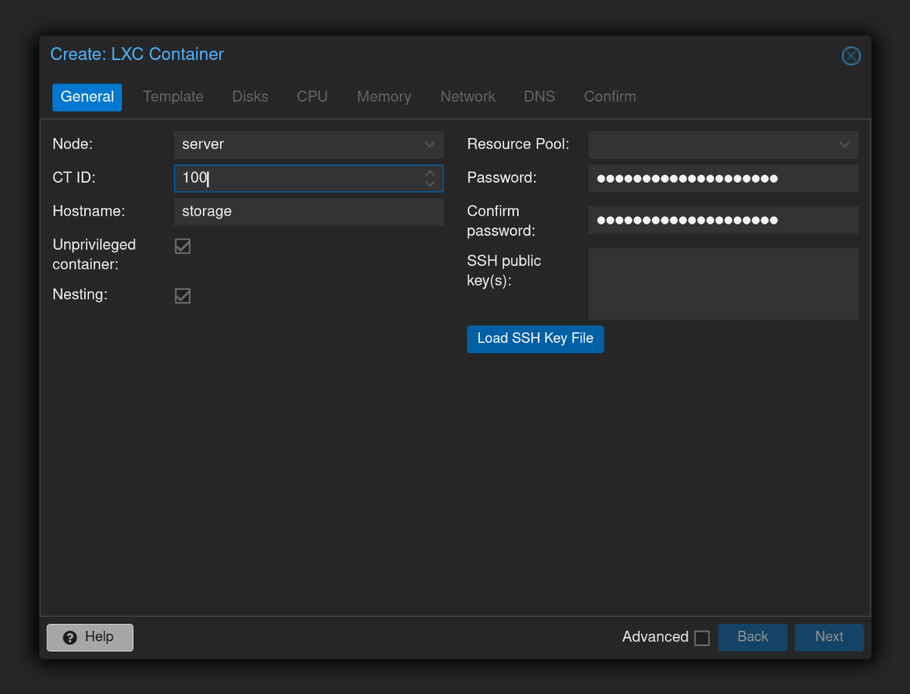
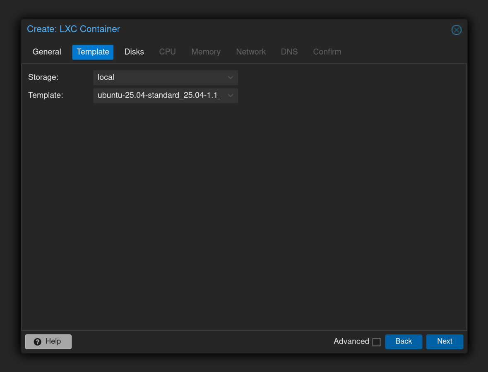
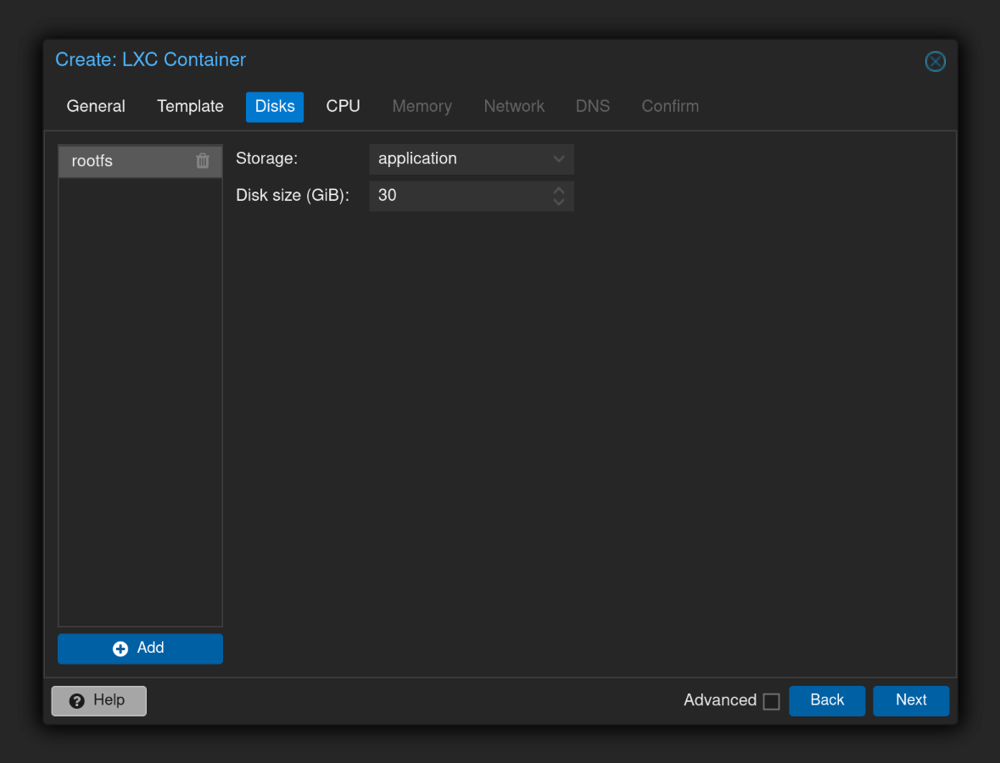
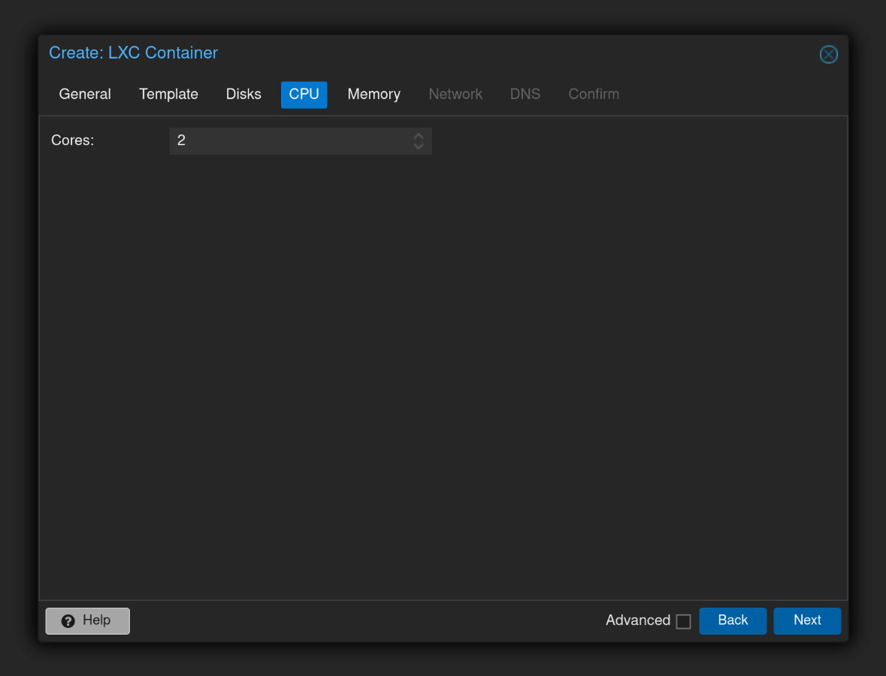
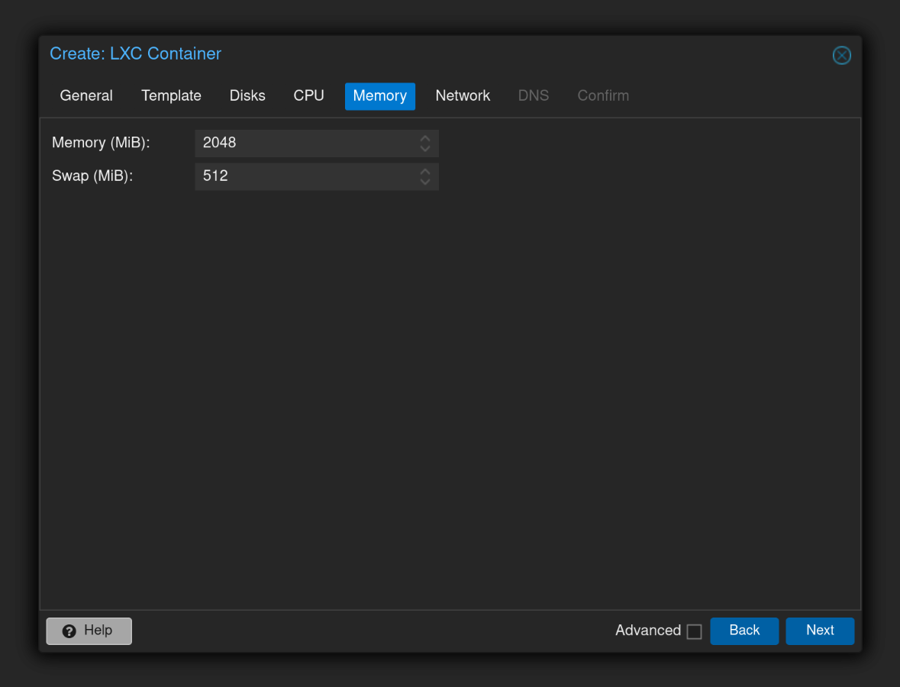
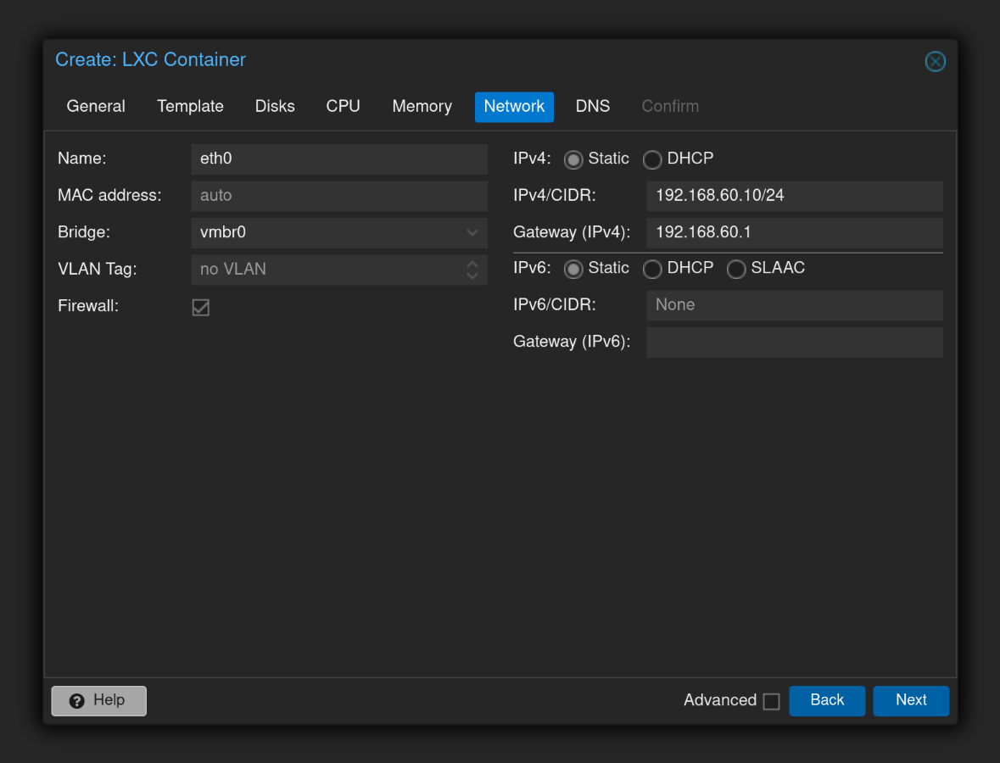
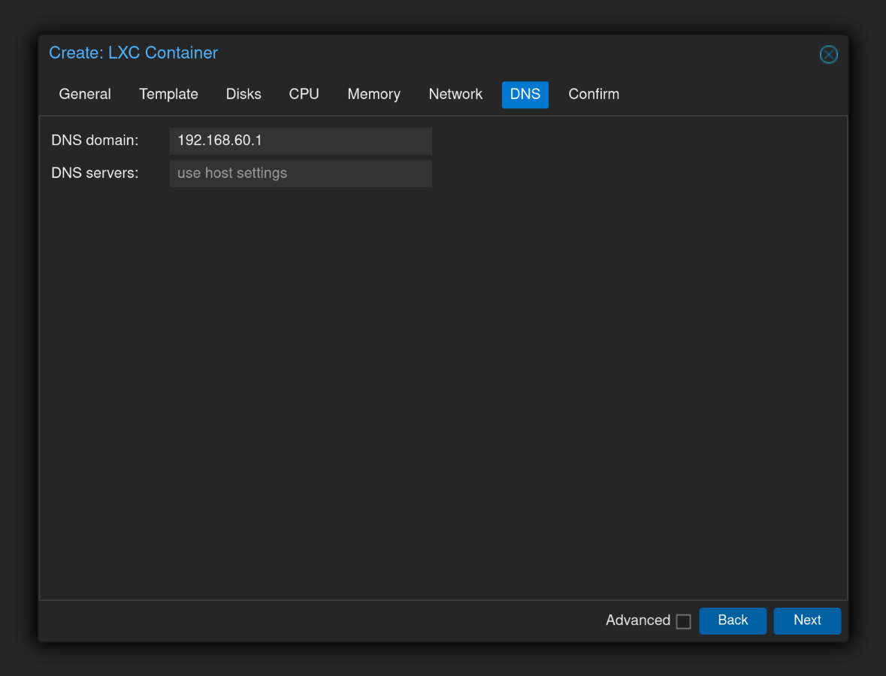
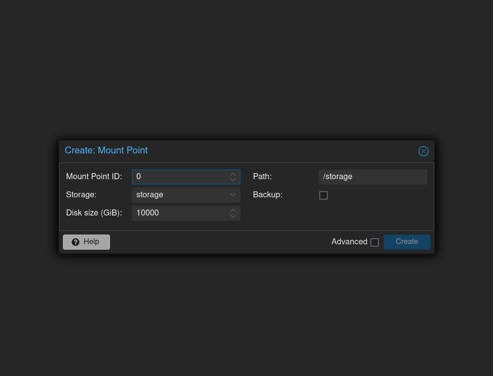

# Storage Server

This guide details the steps to deploy a Container (CT) in Proxmox acting as a dedicated storage server. The server provides shared storage via Samba, which other servers can utilize for content delivery and data sharing. Segregating storage into its own container enhances availability, simplifies maintenance, and improves security.

## Create Container

> **Note**: I would have preferred Fedora to Ubuntu, but running Fedora 42 fails to boot or function due to a misconfigured `systemd-homed-firstboot` service. See https://bugzilla.proxmox.com/show_bug.cgi?id=6392 and https://forum.proxmox.com/threads/fedora-based-lxc-containers-and-no-network-on-startup.129395/. For now, we'll use Ubuntu until Proxmox fixes those container images.










## Setup Container

### 1. Update System Packages

Update the package repository information and upgrade all installed packages.

```shell
apt update -y && apt upgrade -y
```

### 2. Install Samba for File Sharing

Samba enables SMB/CIFS protocol support for sharing files with Windows and Linux clients.

```shell
apt install -y samba
```

### 3. Create a Dedicated User and Group for Managing Shared Content

Create a system user `manager` having escalated privileges, used solely for permission management.

```shell
adduser manager
adduser manager sudo
```

### 4. Prepare Storage Directory

Set ownership and permissions for the `/storage` volume attached by Proxmox.

```shell
chown -R manager:manager /storage
find /storage -type d -exec chmod 775 {} +
find /storage -type f -exec chmod 664 {} +
```

### 5. Configure Samba Shares

Back up the existing Samba configuration.

```shell
mv /etc/samba/smb.conf /etc/samba/smb.conf.old
```

Create a new configuration file.

```shell
nano /etc/samba/smb.conf
```

Paste the following configuration (adjust IP ranges and share name as needed).

```text
[global]
   server string = Storage
   workgroup = WORKGROUP
   security = user
   map to guest = Bad User
   name resolve order = bcast host
   hosts allow = 192.168.0.0/16
   hosts deny = 0.0.0.0/0
[storage]
   path = /storage
   force user = manager
   force group = manager
   create mask = 0644
   force create mode = 0644
   directory mask = 0775
   force directory mode = 0775
   browseable = yes
   writable = yes
   read only = no
   guest ok = no
```

### 6. Create Samba User Account

Add an account for `manager` to access the share. Set a password when prompted.

```shell
smbpasswd -a manager
```

### 7. Enable and Restart Samba Services

Ensure Samba services start on boot and are running.

```shell
systemctl enable smbd nmbd
systemctl restart smbd nmbd
```

### 8. Enable Windows discovery

Optionally, install WSDD allowing the server to be discovered by Windows clients.

```shell
apt install wsdd
apt install wsdd-server
```

### 9. Configure Firewall Rules

Define access and security rules, only allowing SSH and Samba through your firewall.

```shell
ufw allow OpenSSH
ufw allow Samba
```

Open additional ports if WSDD was installed.

```shell
ufw allow 3702/udp
ufw allow 5357/tcp
ufw allow 5358/tcp
```

Optionally, enable UFW to only allow necessary services through your firewall.

```shell
ufw enable
```

### 9. Finalize and Reboot

Reboot the container, ensuring changes to services and configuration are applied.

```shell
reboot
```

